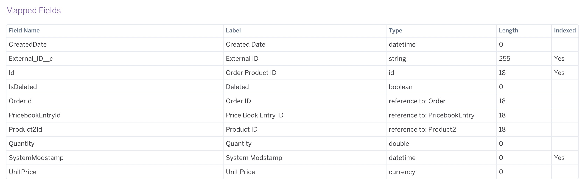

# Salesforce Integration

Resources:

* [https://devcenter.heroku.com/articles/heroku-connect](https://devcenter.heroku.com/articles/heroku-connect)
* [https://devcenter.heroku.com/articles/writing-data-to-salesforce-with-heroku-connect](https://devcenter.heroku.com/articles/writing-data-to-salesforce-with-heroku-connect)

The idea is to show Heroku Connect and it’s bidirectional integration with Salesforce. (Get Salesforce data in an industry standard database where you can write standard SQL to it)

From Salesforce we will be able to create a **Purchase Order **with products from the categories we are using in the application.

_Note: For this demo one product per category is enough but more can be added._

Demand for this product will be shown in the App Dashboard (Data Application), on every new **Purchase Order** from Salesforce we will check the products added to that order and sum up the quantities to give a weight to each category, that weight will be presented as a graphic.

It will give the user the option to create a **Fulfillment Order** of that specific product/category and a quantity to supply demand. Information about Products can be found in the corresponding mapped table in Heroku Connect.

Orders can be created manually from Salesforce or automatically using a script, to keep things simple an order can be created directly in the Heroku Connect PostgreSQL instance, but it can also be created using the Lightning Platform API, since we are using bidirectional synchronization of orders changes are going to be reflected in Salesforce.

A new page within the same application can be created to show the Product Demand Dashboard, quantities can be represented in a way to show both Demand and Supply, where:

* Demand = Total of products by category for all the Activated **Purchase Orders**
* Supply = Total of products by category for all the Activated **Fulfillment Orders**

### Configuration

1. **Create a Salesforce Developer Account**: [https://developer.salesforce.com](https://developer.salesforce.com)
2. **Setup Product Categories**

Go to Setup > Objects and Fields > Object Manager > Product > Fields & Relationships > Product Family

Click New on **Product Family Picklist Values**

Then enter the following list:
- Lawn & Garden
- Electronics
- Apparel
- Home Furnishing
- Housewares
- Toys
- Books

1. **Create at least one product per Category (Product Family)**

Go to the app launcher and search for Product

Then create a new Product per Product Family

Then click on the new Product and go to the **Related** tab, then on **Price Books** section click on **Add Standard Price** and specify a List Price.

Now, click on the **Add to Price Book** and select pricebook **Standard**, and currency **USD.**

Make sure you repeat the same process for each category.

1. **Create Order Type on Order**

Go to Setup > Objects and Fields > Object Manager > Order > Record Types and create the following:

Purchase Order

Fulfillment Order 

_Note: Click on **Enable for Profile** checkbox to make it available for all profiles_

5. **Add Order Type to Layouts (Optional)**

Go to Setup > Objects and Fields > Object Manager > Order > Compact Layouts and click on the **System Default** and **Clone** it, name it **Order Layout with Type** and move the **Order Type** field to **Selected Fields**

Go to Setup > Objects and Fields > Object Manager > Order > Search Layout and select the **Order Type** field.

6. **Create External_ID property on Order and OrderItem objects**

Heroku Connect needs an External ID when doing writes against Salesforce, since we are going to be writing Orders and Products we need to create a custom field in those two objects.

Go to Setup > Objects and Fields > Object Manager > Order > Fields & Relationship and create a new field of type **Text **(255 chars) and name it **External ID**, make sure to select both the **Unique **and **External ID **checkboxes.

Repeat for **Order Product **(OrderItem)

7. **Create a Contract**

Go to Apps > Contracts and create a new **Contract **

After it’s created let’s click on **Activated ** and **Mark Status as Complete**

Take a note of the** Contract** ID, this might be useful when doing PostgreSQL inserts, ID can be retrieved from URL (8003…..AAW)

8. **Add Heroku Connect Addon and Connect it to PostgreSQL and Salesforce**

    Once Heroku Connect is enabled, you’ll need to Setup a Connection, click on the **Heroku Connect** addon and then follow: [https://devcenter.heroku.com/articles/heroku-connect](https://devcenter.heroku.com/articles/heroku-connect)

9. **Heroku Connect Object Mapping**

    These are the mappings that you might want to find useful for this integration, we only really need **Order and OrderItem**, those are going to be enabled as **Read-Write**, just make sure to enable **Write Database** **Updates to Salesforce** using the **External ID** we created previously

### Mappings should look like this

Account

Order

Order Item

Contract

Pricebook2

Pricebook Entry

Product2

Record Type

## **Creating an Order from Heroku App**

To create an order from Heroku to Salesforce we would need to do an INSERT to the **salesforce.order** table with the following properties:

*   accountid: A Salesforce Account ID
*   contractid: A Salesforce Contract ID
*   effectivedate: Format MM/DD/YYYY
*   pricebook2id: A Salesforce Pricebook ID
*   status: Should be **Draft**
*   ordertypeid: Should be the sfid of **Fulfillment Order Type**

Then we need to add products to the order by doing INSERT operations to the ** sales **force.orderitem** table with the following properties:

*   orderid: A Salesforce Order ID (sfid property on order table)
*   product2id: A Salesforce Product ID
*   quantity: Total of products by. order
*   unitprice
*   pricebookentryid: A PricebookEntry ID

## **Troubleshooting**

    Check the **Logs** tab on **Heroku Connect** for **Salesforce Errors**, it’s a good way to make sure you aren’t missing any required field.

